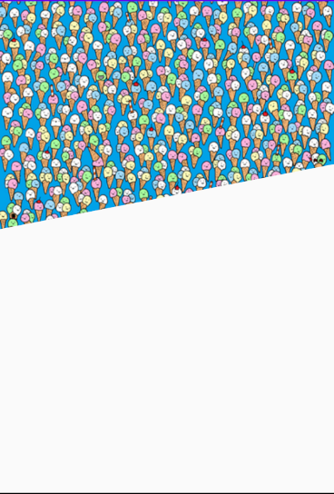
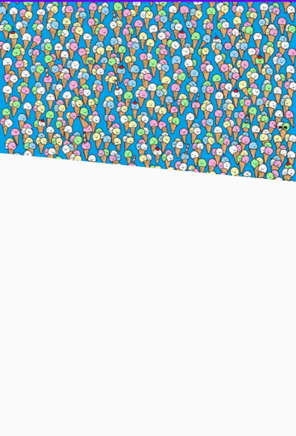

# DiagonalImageView
Diagonal ImageView for Android, written in Kotlin

It is possible to set the slope of the line left / right, defaulted to the right

Usage

<com.customView.DiagonalImageView 
        android:layout_width="match_parent"  
       android:layout_height="wrap_content"  
        app:angleDirection="left"  <-- or  app:angleDirection="right"  
        android:src="@drawable/example"  
        app:heightDiagonal="80dp" />
      
Example

